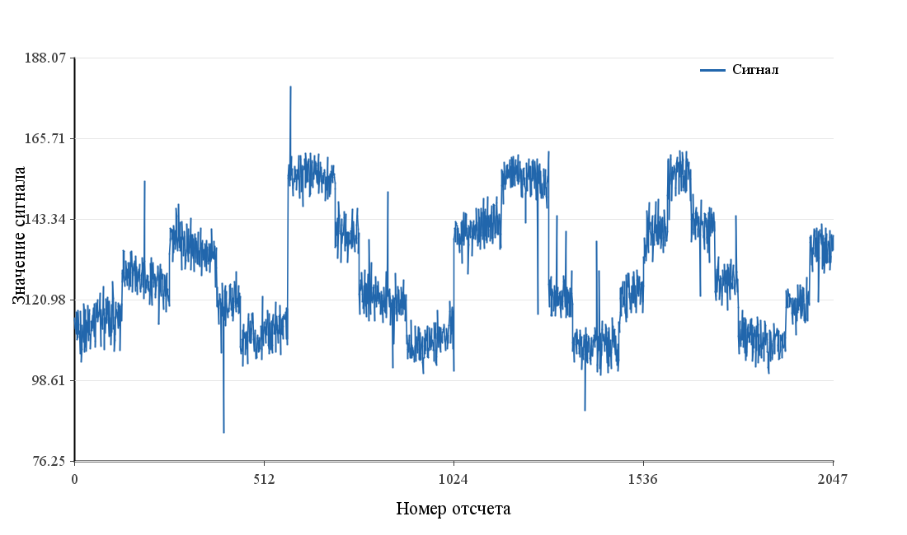
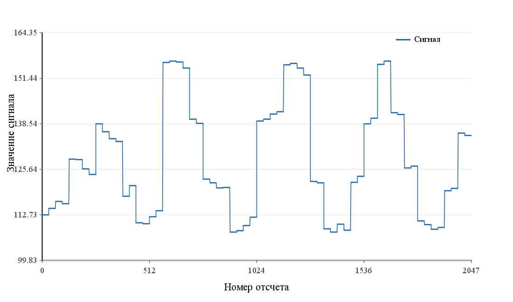
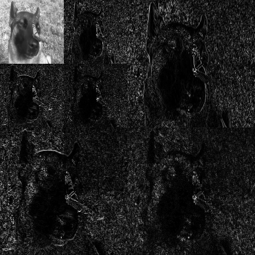

# Fast Haar Transform

Реализация быстрого преобразования Хаара для одномерных сигналов и изображений.
Проект показывает не только сам алгоритм, но и практические сценарии: сравнение
скорости с матричным способом, грубую аппроксимацию сигнала и двумерное
преобразование изображения.

## Суть

Преобразование Хаара переводит сигнал из набора исходных значений в набор
коэффициентов. Эти коэффициенты описывают сигнал на разных уровнях детализации:
сначала общий уровень, затем крупные различия, затем локальные изменения.

Для пары значений `a`, `b` вычисляются два коэффициента:

```text
s = (a + b) / sqrt(2)
d = (a - b) / sqrt(2)
```

`s` хранит общий уровень пары, `d` хранит различие внутри пары. После первого
шага детали сохраняются, а дальнейшее преобразование выполняется только над
коэффициентами аппроксимации. Поэтому результат имеет иерархическую структуру:
крупная форма сигнала отделяется от мелких деталей.

Нормированная форма сохраняет энергию сигнала:

```text
a^2 + b^2 = s^2 + d^2
```

Это удобно при анализе, фильтрации и сжатии: преобразование меняет форму
представления сигнала, но не искажает его общий масштаб.

Прямое матричное преобразование требует хранения матрицы и `O(N^2)` операций.
Быстрое преобразование Хаара не строит матрицу явно: оно последовательно
обрабатывает пары значений и имеет сложность `O(N)`.

## Зачем это нужно

Преобразование Хаара полезно, когда нужно быстро выделить структуру данных:

- сгладить сигнал и убрать мелкие колебания;
- получить грубую аппроксимацию по малому числу коэффициентов;
- отделить общий уровень от локальных изменений;
- подготовить данные к сжатию или фильтрации;
- разложить изображение на область приближения и области деталей.

## Что реализовано

- `HaarTransform.fhtAllLevels` - полное 1D-преобразование.
- `HaarTransform.fht` - преобразование на заданное число уровней.
- `HaarTransform.inverseFht` - обратное 1D-преобразование.
- `HaarTransform.naiveHt` - матричный способ для сравнения.
- `HaarTransform.fht2d` - двумерное преобразование для изображений.

Все основные методы работают на месте: входной массив или матрица
перезаписываются результатом.

## Одномерный сигнал

В эксперименте используется синтетический сигнал длины `2048`. Он состоит из
участков с разным уровнем, небольших колебаний, шума и редких выбросов. Такой
сигнал удобен для демонстрации: у него есть видимая крупная структура и мелкие
локальные изменения.

После преобразования сохраняются только первые `64` коэффициента, остальные
зануляются. Затем выполняется обратное преобразование. В результате получается
ступенчатая аппроксимация: общая форма сигнала сохраняется, а шум и мелкие
выбросы сглаживаются.

## Пример аппроксимации

Исходный сигнал:



Восстановление по первым 64 коэффициентам:



## Двумерное преобразование

Для изображения алгоритм применяется отдельно к строкам и столбцам. После
одного уровня получается четыре области:

- `LL` - грубое приближение изображения;
- `LH`, `HL`, `HH` - детали по разным направлениям.

Следующий уровень применяется только к области `LL`. Так изображение получает
многоуровневую структуру: в левом верхнем углу находится приближение, остальные
области содержат детали.

## Пример для изображения

Исходное изображение:


Коэффициенты двумерного преобразования Хаара:



## Эксперименты

`RuntimeExperiment` сравнивает время работы двух подходов:

- `naiveHt` - прямое умножение на матрицу Хаара;
- `fhtAllLevels` - быстрое преобразование Хаара.

Результаты записываются в `runtime.csv`. По ним видно, что матричный метод
быстро становится дорогим при росте длины сигнала, а быстрый алгоритм остается
практически применимым для больших массивов.

`SignalStructureExperiment` строит графики исходного сигнала, аппроксимации и
полного восстановления. Он нужен только для иллюстраций к практической части.

## Структура

- `src/main/java/ru/ht/HaarTransform.java` - основной алгоритм.
- `src/main/java/ru/ht/util/RuntimeExperiment.java` - сравнение времени работы.
- `src/main/java/ru/ht/util/SignalStructureExperiment.java` - генерация графиков сигнала.
- `src/test/java/ru/ht/HaarTransformTest.java` - тесты прямого и обратного преобразования.
- `process.tex` - текст отчета.

## Запуск

Тесты:

```bash
./gradlew test
```

Сборка:

```bash
./gradlew compileJava
```

Эксперименты можно запускать из IDE через методы `main` в классах
`RuntimeExperiment`, `SignalStructureExperiment` и `HaarTransform`.
